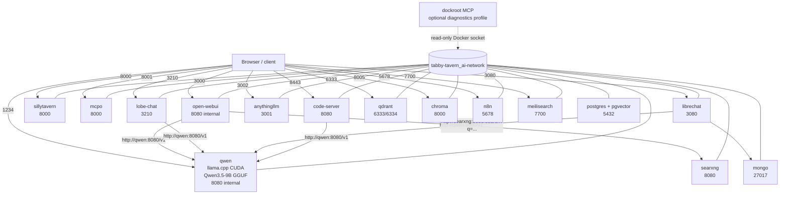

# Unified Tabby-Tavern Stack Report

Verified after consolidation on the WSL Docker host.

## Result

All active services now use one Compose project and one Docker network:

```text
Compose project: tabby-tavern
Compose file:    /home/jpanasuk/tabby-tavern/docker-compose.yml
Network:         tabby-tavern_ai-network
```

The old Taproot and qwen38-agent containers were stopped. The stale stopped containers named `tabby-tavern-tabbyapi-1` and `tabby-tavern-ollama-1` were removed after the new unified compose was validated. No volumes were removed.

The merge includes:

- Taproot/Qwen llama.cpp runtime
- Tabby-Tavern chat services
- Coding starter pack services
- dockroot MCP Docker-observability image, available behind the optional `diagnostics` profile
- Existing named data volumes preserved where available

## Live node graph



## Host URLs

```text
Primary chat UI       http://localhost:3000
Qwen OpenAI API       http://localhost:1234/v1
Qwen health           http://localhost:1234/health
SillyTavern           http://localhost:8000
MCPO docs             http://localhost:8001/docs
SearXNG               http://localhost:8080
Code-server           http://localhost:8443
LibreChat             http://localhost:3080
Lobe Chat             http://localhost:3210
AnythingLLM           http://localhost:3002
n8n                   http://localhost:5678
Qdrant REST           http://localhost:6333
Qdrant gRPC           localhost:6334
Chroma                http://localhost:8005
Meilisearch           http://localhost:7700
Postgres              localhost:5432
```

`localhost` means the WSL host. From another container on the shared Docker network, use the service name and internal port, not localhost.

## Internal Docker URLs

```text
open-webui  -> http://qwen:8080/v1
lobe-chat   -> http://qwen:8080/v1
librechat   -> http://qwen:8080/v1
code-server -> http://qwen:8080/v1
open-webui  -> http://searxng:8080/search?q=<query>
librechat  -> mongodb://mongo:27017/LibreChat
```

The universal OpenAI-compatible form is:

```text
http://qwen:8080/v1
```

The served model alias is:

```text
Qwen3.5-9B
```

## Node inventory

| Node | Container | Image | Host port | Function | State at verification |
|---|---|---|---:|---|---|
| qwen | tabby-tavern-qwen | ghcr.io/ggml-org/llama.cpp:server-cuda | 1234 | Qwen3.5-9B GGUF inference | healthy |
| open-webui | tabby-tavern-open-webui | ghcr.io/open-webui/open-webui:main | 3000 | canonical chat UI | starting/HTTP still initializing during first check |
| sillytavern | tabby-tavern-sillytavern | ghcr.io/sillytavern/sillytavern:latest | 8000 | character chat frontend | running; root returned 401, expected auth behavior |
| searxng | tabby-tavern-searxng | docker.io/searxng/searxng:latest | 8080 | private search | running; search returned HTTP 200 |
| mcpo | tabby-tavern-mcpo | ghcr.io/open-webui/mcpo:main | 8001 | MCP-to-HTTP gateway | running; `/docs` HTTP 200 |
| code-server | tabby-tavern-code-server | codercom/code-server:latest | 8443 | browser VS Code IDE | running; HTTP 200 |
| qdrant | tabby-tavern-qdrant | qdrant/qdrant:latest | 6333, 6334 | vector database / RAG | running; `/healthz` HTTP 200 |
| chroma | tabby-tavern-chroma | chromadb/chroma:latest | 8005 | lightweight vector database | running; old heartbeat path returned 410, not a process failure |
| n8n | tabby-tavern-n8n | n8nio/n8n:latest | 5678 | workflow automation | running; root endpoint reset during startup/auth handling |
| lobe-chat | tabby-tavern-lobe-chat | lobehub/lobe-chat:latest | 3210 | chat frontend | running |
| anythingllm | tabby-tavern-anythingllm | mintplexlabs/anythingllm:latest | 3002 | RAG workspace | running; health was still starting at first check |
| librechat | tabby-tavern-librechat | ghcr.io/danny-avila/librechat:latest | 3080 | multi-model chat frontend | running |
| mongo | tabby-tavern-mongo | mongo:7 | 27017 | LibreChat database | running |
| meilisearch | tabby-tavern-meilisearch | getmeili/meilisearch:latest | 7700 | full-text search | running; `/health` HTTP 200 |
| postgres | tabby-tavern-postgres | pgvector/pgvector:pg16 | 5432 | Postgres + pgvector, intended Hermes memory backend | healthy |
| dockroot | tabby-tavern-dockroot | local/dockroot-mcp:unified | none | read-only Docker/MCP observability | optional; `diagnostics` profile |

## Inference profiles

The default stack runs Qwen only. This is intentional because the RTX 4070 has limited VRAM and multiple GPU engines can block or exhaust memory.

Start alternate engines only when Qwen is stopped or when you deliberately want to test contention:

```bash
cd /home/jpanasuk/tabby-tavern

docker compose --profile alternate-inference up -d tabbyapi ollama
```

Alternate internal APIs:

```text
tabbyapi -> http://tabbyapi:5000/v1
ollama   -> http://ollama:11434/v1
```

Host APIs:

```text
TabbyAPI -> http://localhost:5000/v1
Ollama   -> http://localhost:11435/v1
```

The alternate profile is not started by default. It prevents the known multi-engine GPU contention problem.

## dockroot integration

Dockroot source remains at:

```text
/home/jpanasuk/dockroot
```

It was incorporated into the unified compose as a buildable optional service:

```yaml
dockroot:
  profiles: [diagnostics]
  build:
    context: ../dockroot
  image: local/dockroot-mcp:unified
  container_name: tabby-tavern-dockroot
  volumes:
    - /var/run/docker.sock:/var/run/docker.sock:ro
```

Start it with:

```bash
cd /home/jpanasuk/tabby-tavern
docker compose --profile diagnostics up -d --build dockroot
```

It exposes read-only MCP/Docker inspection functionality and is not bound to a host port. The Docker socket is powerful, so keep this service internal.

## Data preservation

The unified compose references the existing named volumes:

```text
tabby-tavern_open-webui
basecamp_code-server-data
basecamp_qdrant-data
basecamp_chroma-data
basecamp_n8n-data
basecamp_lobe-chat-data
basecamp_anythingllm-data
basecamp_librechat-data
basecamp_mongo-data
basecamp_meilisearch-data
basecamp_postgres_data
```

The existing source/config backup is under:

```text
/home/jpanasuk/tabby-tavern/backups/20260825-023038
```

The original Taproot and qwen38-agent compose files were not deleted. They remain at:

```text
/home/jpanasuk/taproot/docker-compose.yml
/home/jpanasuk/qwen38-agent/docker-compose.yml
```

## Canonical files

```text
/home/jpanasuk/tabby-tavern/docker-compose.yml
/home/jpanasuk/tabby-tavern/ide-config/continue-config.json
/home/jpanasuk/tabby-tavern/mcpo/config.json
/home/jpanasuk/tabby-tavern/chat-templates/chat_template.jinja
/home/jpanasuk/tabby-tavern/tabby_config/config.yml
/home/jpanasuk/tabby-tavern/tabby_config/api_tokens.yml
/home/jpanasuk/tabby-tavern/searxng_config/settings.yml
```

## Verification commands and results

```bash
docker compose -f /home/jpanasuk/tabby-tavern/docker-compose.yml config --quiet
# passed

docker compose -f /home/jpanasuk/tabby-tavern/docker-compose.yml ps
# 15 default services created/running; qwen and postgres healthy

docker network inspect tabby-tavern_ai-network
# all 15 default services attached to one network

curl http://localhost:1234/health
# HTTP 200

curl http://localhost:1234/v1/models
# HTTP 200

curl http://localhost:8080/search?q=test\&format=json
# HTTP 200

curl http://localhost:8001/docs
# HTTP 200

curl http://localhost:8443
# HTTP 200

curl http://localhost:6333/healthz
# HTTP 200

curl http://localhost:7700/health
# HTTP 200
```

Open WebUI and AnythingLLM were still reporting startup/health initialization during the immediate post-recreate probe. Their containers were running; allow their normal startup time before treating them as failed.

## Bottom line

The requested consolidation is now represented by one canonical stack:

```text
/home/jpanasuk/tabby-tavern/docker-compose.yml
```

Project name: `tabby-tavern`

Shared network: `tabby-tavern_ai-network`

Primary model endpoint: `http://qwen:8080/v1` from containers, `http://localhost:1234/v1` from the host.

The old Taproot and qwen38-agent runtime containers are no longer running, and the service definitions have been folded into Tabby-Tavern rather than merely attached as separate projects.

Generated: 2026-08-25
